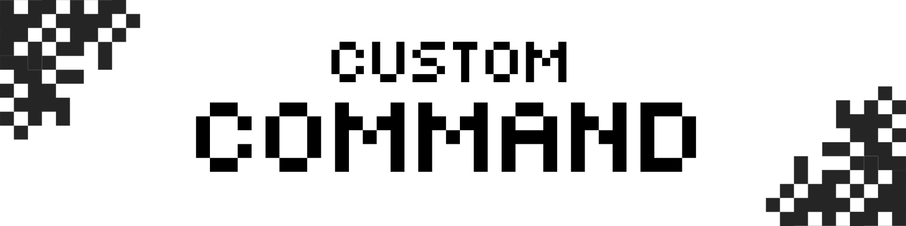

# 🛠️ Custom Command (Behavior Pack)

[](#)
[](#)
[](#)
[](#)



**Custom Command BP** adalah kerangka kerja (*framework*) berbasis Script API (`@minecraft/server`) untuk Minecraft Bedrock Edition. Addon ini memungkinkan pembuat konten (*creators*) dan administrator dunia untuk mendaftarkan serta mengelola perintah kustom (*custom commands*) dengan sangat mudah melalui konfigurasi JavaScript terpusat.

---

## ✨ Fitur Utama

* **⚡ Pendaftaran Perintah Kustom Dinamis**  
  Mendaftarkan perintah baru secara otomatis saat dunia dimuat tanpa perlu menyusun fungsi pendaftaran manual berulang kali.
  
* **🛡️ Sistem Perizinan (Permission) yang Kuat**  
  Membatasi akses perintah menggunakan kombinasi syarat seperti:
  * Status **Operator (OP)** dunia.
  * Kepemilikan **Tag Tertentu** (*whitelist tags*).
  * Pemblokiran tag tertentu (*blacklist tags*).
  * Logika pencocokan fleksibel (`AND` / `OR`).

* **🔄 Eksekusi Perintah Sekuensial**  
  Menjalankan daftar perintah bawaan Minecraft (*sub-commands*) secara berurutan untuk target yang ditentukan.

* **🎯 Penerjemah Selector Pintar**  
  Mendukung selector default seperti `@s`, `@a`, maupun nama pemain tertentu. Addon secara cerdas menggunakan tag penanda unik sementara (`cc_temp_xxxxxx`) untuk memastikan sub-command dieksekusi tepat sasaran tanpa memengaruhi pemain lain.

---

## 🔍 Preview / Gambaran Alur Kerja

### 1. Struktur Konfigurasi Sederhana (`config.js`)
Anda hanya perlu menambahkan objek konfigurasi baru untuk mendaftarkan perintah kustom baru:

```javascript
{
    name: "starterpack",
    permissions: {
        tags: [],
        blacklistTags: ["starterpack"], // Mencegah klaim ganda
        requiresOp: false,
        matchType: "OR"
    },
    commands: [
        "tag (selector) add starterpack",
        "give (selector) wooden_sword",
        "give (selector) wooden_pickaxe",
        "give (selector) bread 16"
    ]
}
```

### 2. Jalannya Eksekusi di Dalam Dunia Game

```text
[Pemain: Rafly] ── Mengetik ──> /custom:starterpack @s
       │
       ├──> [Sistem Memeriksa Syarat...]
       │     ├── Player memiliki tag "starterpack"? (Tidak) -> Lolos
       │     └── Player adalah OP? (Tidak diperlukan) -> Lolos
       │
       ├──> [Sistem Membuat Tag Sementara...] 
       │     └── Tag "cc_temp_482910" diberikan ke Rafly
       │
       ├──> [Sistem Mengeksekusi Sub-Command...]
       │     ├── /execute as @a[tag=cc_temp_482910] ... run tag @s add starterpack
       │     ├── /execute as @a[tag=cc_temp_482910] ... run give @s wooden_sword
       │     ├── /execute as @a[tag=cc_temp_482910] ... run give @s wooden_pickaxe
       │     └── /execute as @a[tag=cc_temp_482910] ... run give @s bread 16
       │
       └──> [Sistem Membersihkan Tag Sementara...]
             └── Tag "cc_temp_482910" dihapus dari Rafly. Selesai!
```

---

## 📷 Screenshoot


## 🤝 Lisensi & Kontribusi Komunitas

Proyek ini sepenuhnya bersifat **terbuka (*open-source*)**. 

Kami sangat mendukung kolaborasi dalam ekosistem pengembangan Minecraft:
* **Modifikasi Bebas**: Siapa pun berhak menyalin, mengubah, menyebarkan, serta mengintegrasikan proyek ini ke dalam dunia atau server mereka secara gratis.
* **Kolaborasi Terbuka**: Anda dapat berkontribusi untuk menyempurnakan logika pendaftaran perintah, memperbaiki bug, atau menambahkan fitur baru guna mendukung pengembangan komunitas Minecraft.

*Dibuat untuk mempermudah kreativitas komunitas Minecraft Bedrock.*
